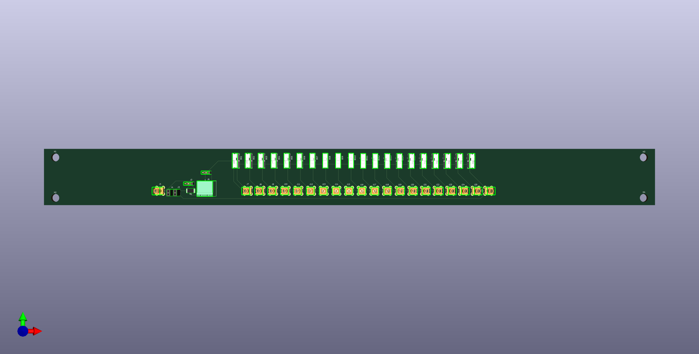

# iseg-hv-saftey-loop

PCB-based design for iseg HV power supply safety loop with filtering capacitors and bypass switches.

EDA software: KiCAD 7.0

# Note:
3D printed cover must be fabricated and mounted on safety loop board to guarantee personnel and equipment safety. \
You can find it at HV_Safety_Loop/v2/CAD

# screenshot

